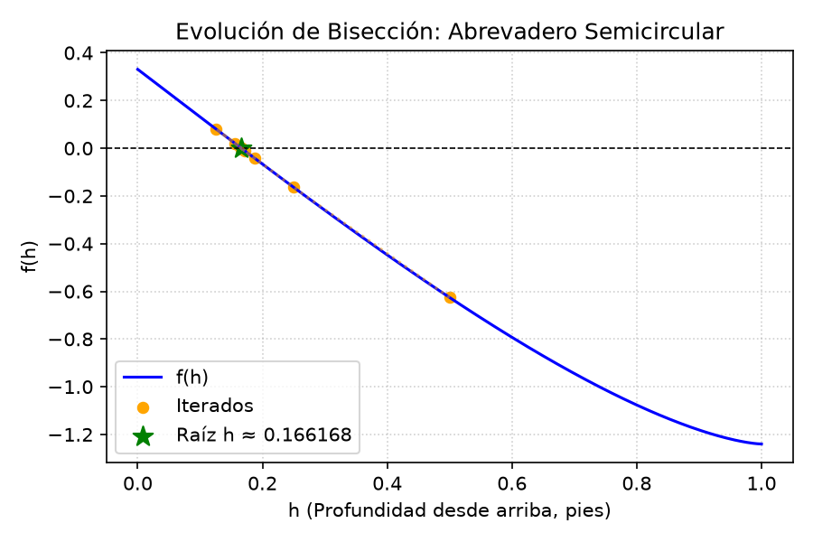
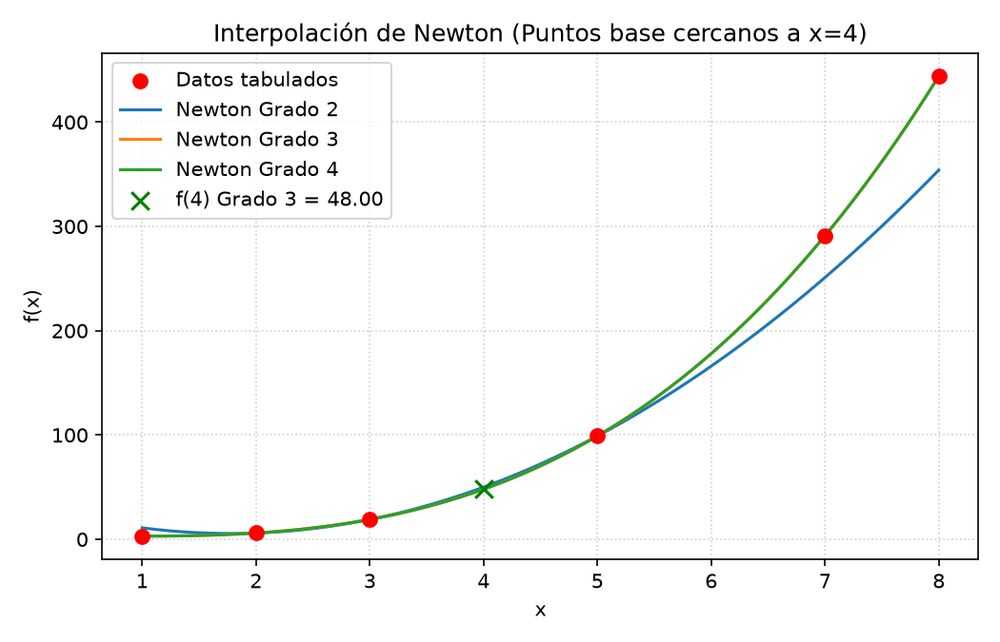

# Estudio de Ejercicios: Resolución y Análisis Numérico

Este documento contiene el desarrollo detallado y la ejecución numérica de cada uno de los ejercicios asignados en el proyecto, resueltos a través de la biblioteca matemática y el programa del sistema.

---

## 1. Método de Bisección (Cálculo de Raíces)

### Problema: Determinación de la Profundidad de un Abrevadero Semicircular

#### Enunciado y Formulación Matemática
Un abrevadero de longitud $L = 10$ pies tiene una sección transversal semicircular de radio $r = 1$ pie. Cuando el volumen de agua es $V = 12.4$ pies³, deseamos determinar la distancia $h$ desde la parte superior del abrevadero hasta la superficie libre del agua. La ecuación de volumen está dada por:
$$V = L \left[ 0.5\pi r^2 - r^2 \arcsin\left(\frac{h}{r}\right) - h\sqrt{r^2 - h^2} \right]$$

Sustituyendo los parámetros ($L = 10$, $r = 1$, $V = 12.4$), obtenemos la ecuación a resolver:
$$12.4 = 10 \left[ 0.5\pi(1)^2 - (1)^2 \arcsin(h) - h\sqrt{1 - h^2} \right]$$
$$1.24 = 0.5\pi - \arcsin(h) - h\sqrt{1 - h^2}$$
$$f(h) = 0.5\pi - \arcsin(h) - h\sqrt{1 - h^2} - 1.24 = 0$$

Dado que $r = 1$ pie, el valor físico de $h$ debe encontrarse en el intervalo $[0, 1]$. Evaluando los extremos del intervalo para verificar el cambio de signo:
*   $f(0) = 0.5\pi - 0 - 0 - 1.24 = 1.570796 - 1.24 = 0.330796 > 0$
*   $f(1) = 0.5\pi - \arcsin(1) - \sqrt{0} - 1.24 = 0.5\pi - 0.5\pi - 1.24 = -1.24 < 0$

Como $f(0) \cdot f(1) < 0$ y $f(h)$ es continua en $[0, 1]$, el teorema del valor intermedio garantiza la existencia de al menos una raíz en el intervalo.

#### Resultados Numéricos de la Ejecución
Aplicando el método de bisección con una tolerancia de $10^{-5}$ ($0.00001$), el algoritmo converge en **15 iteraciones**:

| Iteración | Extremo inferior ($x_l$) | Extremo superior ($x_u$) | Punto Medio ($x_r$) | Evaluación $f(x_r)$ | Error Relativo Aprox ($e_a$) |
|---|---|---|---|---|---|
| 1 | 0.000000 | 0.500000 | 0.500000 | -6.258152e-01 | 100.000000% |
| 2 | 0.000000 | 0.250000 | 0.250000 | -1.639454e-01 | 100.000000% |
| 3 | 0.125000 | 0.250000 | 0.125000 | 8.144890e-02 | 100.000000% |
| 4 | 0.125000 | 0.187500 | 0.187500 | -4.199467e-02 | 33.333333% |
| 5 | 0.156250 | 0.187500 | 0.156250 | 1.957259e-02 | 20.000000% |
| 6 | 0.156250 | 0.171875 | 0.171875 | -1.125364e-02 | 9.090909% |
| 7 | 0.164062 | 0.171875 | 0.164062 | 4.149324e-03 | 4.761905% |
| 8 | 0.164062 | 0.167969 | 0.167969 | -3.554758e-03 | 2.325581% |
| 9 | 0.166016 | 0.167969 | 0.166016 | 2.966411e-04 | 1.176471% |
| 10 | 0.166016 | 0.166992 | 0.166992 | -1.629220e-03 | 0.584795% |
| 11 | 0.166016 | 0.166504 | 0.166504 | -6.663296e-04 | 0.293255% |
| 12 | 0.166016 | 0.166260 | 0.166260 | -1.848543e-04 | 0.146843% |
| 13 | 0.166138 | 0.166260 | 0.166138 | 5.589087e-05 | 0.073475% |
| 14 | 0.166138 | 0.166199 | 0.166199 | -6.448235e-05 | 0.036724% |
| 15 | 0.166138 | 0.166168 | 0.166168 | -4.295899e-06 | 0.018365% |

**Valor de convergencia:**
*   $h \approx 0.166168$ pies (distancia del agua a la parte superior).
*   **Profundidad real del agua ($d$):**
    $$d = r - h = 1.0 - 0.166168 = 0.833832 \text{ pies}$$

#### Evolución Gráfica del Algoritmo
La gráfica generada por el programa muestra cómo los iterados (puntos naranjas) se van reduciendo rápidamente hacia el punto de raíz sobre el eje horizontal de corte cero:

---

## 2. Resoluciones de Sistemas de Ecuaciones Lineales (Chapra Capítulo 12)

### Contexto General: Sistema de 5 Reactores Acoplados
El balance de masa de contaminantes químicos en estado estacionario para una red de 5 tanques de mezcla acoplados genera un sistema de 5 ecuaciones lineales. La conservación de masa por reactor dicta que las entradas de masa deben balancear las salidas.

### Problema 12.1: Modificación de Flujos y Concentraciones de Entrada
En este ejercicio se alteran las concentraciones de entrada de contaminante a $c_{01} = 40$ y $c_{03} = 10$, y se modifican los caudales de flujo de agua: $Q_{01} = 6$, $Q_{12} = 4$, $Q_{24} = 2$ y $Q_{44} = 12$. 

Derivando los nuevos balances por nodo y asegurando la conservación de los flujos de agua (donde entra y sale exactamente el mismo caudal total por reactor), obtenemos el siguiente sistema algebraico:
1.  **Reactor 1:** $Q_{01}c_{01} + Q_{31}c_3 = (Q_{12} + Q_{15})c_1 \Rightarrow 6(40) + c_3 = 7c_1 \Rightarrow 7c_1 - c_3 = 240$
2.  **Reactor 2:** $Q_{12}c_1 = (Q_{23} + Q_{24} + Q_{25})c_2 \Rightarrow 4c_1 = 4c_2 \Rightarrow -4c_1 + 4c_2 = 0$
3.  **Reactor 3:** $Q_{03}c_{03} + Q_{23}c_2 = (Q_{31} + Q_{34})c_3 \Rightarrow 8(10) + c_2 = 9c_3 \Rightarrow -c_2 + 9c_3 = 80$
4.  **Reactor 4:** $Q_{24}c_2 + Q_{34}c_3 + Q_{54}c_5 = Q_{44}c_4 \Rightarrow 2c_2 + 8c_3 + 2c_5 = 12c_4 \Rightarrow -2c_2 - 8c_3 + 12c_4 - 2c_5 = 0$
5.  **Reactor 5:** $Q_{15}c_1 + Q_{25}c_2 = (Q_{54} + Q_{55})c_5 \Rightarrow 3c_1 + c_2 = 4c_5 \Rightarrow -3c_1 - c_2 + 4c_5 = 0$

En forma matricial $A c = b$:
$$\begin{pmatrix}
7 & 0 & -1 & 0 & 0 \\
-4 & 4 & 0 & 0 & 0 \\
0 & -1 & 9 & 0 & 0 \\
0 & -2 & -8 & 12 & -2 \\
-3 & -1 & 0 & 0 & 4
\end{pmatrix}
\begin{pmatrix}
c_1 \\ c_2 \\ c_3 \\ c_4 \\ c_5
\end{pmatrix} =
\begin{pmatrix}
240 \\ 0 \\ 80 \\ 0 \\ 0
\end{pmatrix}$$

#### Solución Obtenida
Resolviendo mediante el módulo `GaussSimple` con pivoteo parcial (máximo de columna):
*   $c_1 = 36.129032 \text{ mg/m}^3$
*   $c_2 = 36.129032 \text{ mg/m}^3$
*   $c_3 = 12.903226 \text{ mg/m}^3$
*   $c_4 = 20.645161 \text{ mg/m}^3$
*   $c_5 = 36.129032 \text{ mg/m}^3$

---

### Problema 12.2: Análisis de Sensibilidad mediante Matriz Inversa
Si la entrada de contaminante al reactor 3 original disminuye un 25%, deseamos calcular el cambio porcentual resultante en los reactores 1 y 4 usando la matriz inversa original $A^{-1}$.

1.  **Carga Original y Cambio de Carga ($\Delta b$):**
    *   Carga original al reactor 3: $Q_{03}c_{03} = 8(20) = 160$ mg/min.
    *   Una reducción de 25% representa: $-160 \times 0.25 = -40$ mg/min.
    *   Vector de cambio en cargas: $\Delta b = [0, 0, -40, 0, 0]^T$.
2.  **Matriz Inversa Original ($A^{-1}$):**
    $$A^{-1} = \begin{pmatrix}
    0.169811 & 0.006289 & 0.018868 & 0.000000 & 0.000000 \\
    0.169811 & 0.339623 & 0.018868 & 0.000000 & 0.000000 \\
    0.018868 & 0.037736 & 0.113208 & 0.000000 & 0.000000 \\
    0.060034 & 0.074614 & 0.087479 & 0.090909 & 0.045455 \\
    0.169811 & 0.089623 & 0.018868 & 0.000000 & 0.250000
    \end{pmatrix}$$
3.  **Cálculo de $\Delta c = A^{-1} \Delta b$:**
    Dado que únicamente la tercera entrada de $\Delta b$ no es nula, el cambio $\Delta c$ es simplemente la tercera columna de $A^{-1}$ multiplicada por $-40$:
    $$\Delta c = -40 \times \begin{pmatrix} 0.018868 \\ 0.018868 \\ 0.113208 \\ 0.087479 \\ 0.018868 \end{pmatrix} = \begin{pmatrix} -0.754717 \\ -0.754717 \\ -4.528302 \\ -3.499142 \\ -0.754717 \end{pmatrix} \text{ mg/m}^3$$
4.  **Concentraciones Originales ($c_{\text{orig}}$) y Cambio Porcentual:**
    *   $c_{1, \text{orig}} = 11.509434 \text{ mg/m}^3$
    *   $c_{4, \text{orig}} = 16.998285 \text{ mg/m}^3$
    *   **Cambio % en Reactor 1:**
        $$\Delta \% c_1 = \frac{-0.754717}{11.509434} \times 100\% = -6.5574\%$$
    *   **Cambio % en Reactor 4:**
        $$\Delta \% c_4 = \frac{-3.499142}{16.998285} \times 100\% = -20.5853\%$$

---

### Problema 12.3: Conservación Global de Flujo
Dado que el sistema de reactores conectados se encuentra en estado estacionario y el volumen de líquido dentro de cada uno de ellos es constante, la masa total de fluido (agua) que ingresa desde el exterior debe igualar a la que sale hacia el exterior.

*   **Flujos de Entrada desde el exterior:** $Q_{01}$ (entra al reactor 1) y $Q_{03}$ (entra al reactor 3).
*   **Flujos de Salida hacia el exterior:** $Q_{44}$ (sale del reactor 4) y $Q_{55}$ (sale del reactor 5).

Por lo tanto, se puede afirmar de forma inequívoca que:
$$Q_{01} + Q_{03} = Q_{44} + Q_{55}$$
Sustituyendo los valores originales del problema:
$$5 + 8 = 11 + 2 \Rightarrow 13 \text{ m}^3\text{/min} = 13 \text{ m}^3\text{/min}$$
Esta ecuación de balance macroscópico se mantiene constante siempre que el sistema opere en estado estacionario.

---

### Problema 12.4: Flujos Completamente Cambiados
Se ingresan nuevos flujos y caudales a la red de tanques. La concentración de entrada es $c_{01}=10$ y $c_{03}=20$. Derivando los nuevos balances de masa en estado estacionario para cada reactor:
1.  **Reactor 1:** $(Q_{12} + Q_{15})c_1 - Q_{31}c_3 = Q_{01}c_{01} \Rightarrow (4 + 4)c_1 - 3c_3 = 50 \Rightarrow 8c_1 - 3c_3 = 50$
2.  **Reactor 2:** $-Q_{12}c_1 + (Q_{23} + Q_{24} + Q_{25})c_2 = 0 \Rightarrow -4c_1 + (2 + 0 + 2)c_2 = 0 \Rightarrow -4c_1 + 4c_2 = 0$
3.  **Reactor 3:** $-Q_{23}c_2 + (Q_{31} + Q_{34})c_3 = Q_{03}c_{03} \Rightarrow -2c_2 + (3 + 7)c_3 = 160 \Rightarrow -2c_2 + 10c_3 = 160$
4.  **Reactor 4:** $-Q_{24}c_2 - Q_{34}c_3 + Q_{44}c_4 - Q_{54}c_5 = 0 \Rightarrow 0c_2 - 7c_3 + 10c_4 - 3c_5 = 0 \Rightarrow -7c_3 + 10c_4 - 3c_5 = 0$
5.  **Reactor 5:** $-Q_{15}c_1 - Q_{25}c_2 + (Q_{54} + Q_{55})c_5 = 0 \Rightarrow -4c_1 - 2c_2 + (3 + 3)c_5 = 0 \Rightarrow -4c_1 - 2c_2 + 6c_5 = 0$

Matriz aumentada $[A | b]$:
$$\begin{pmatrix}
8 & 0 & -3 & 0 & 0 & | & 50 \\
-4 & 4 & 0 & 0 & 0 & | & 0 \\
0 & -2 & 10 & 0 & 0 & | & 160 \\
0 & 0 & -7 & 10 & -3 & | & 0 \\
-4 & -2 & 0 & 0 & 6 & | & 0
\end{pmatrix}$$

#### Solución de Concentraciones
*   $c_1 = 13.243243 \text{ mg/m}^3$
*   $c_2 = 13.243243 \text{ mg/m}^3$
*   $c_3 = 18.648649 \text{ mg/m}^3$
*   $c_4 = 17.027027 \text{ mg/m}^3$
*   $c_5 = 13.243243 \text{ mg/m}^3$

---

## 3. Métodos de Interpolación (Chapra Capítulo 18)

### Problemas 18.5 y 18.7: Estimación de f(4)

#### Datos Tabulados
$$x = [1, 2, 3, 5, 7, 8], \quad f(x) = [3, 6, 19, 99, 291, 444]$$

Para lograr la mayor exactitud al aproximar $f(4)$, se eligen los puntos base más cercanos a $x = 4$ de forma secuencial:
Puntos ordenados por proximidad a 4: **$x = [3, 5, 2, 7, 1, 8]$**

#### Resoluciones por Newton (18.5) y Lagrange (18.7)
*   **Grado 1 (2 puntos: $x \in \{3, 5\}$):**
    *   Newton Coeficientes: $b_0 = 19.0$, $b_1 = \frac{99 - 19}{5 - 3} = 40.0$
    *   Polinomio: $P_1(x) = 19 + 40(x - 3)$
    *   Estimación: $P_1(4) = 19 + 40(1) = 59.0$
*   **Grado 2 (3 puntos: $x \in \{3, 5, 2\}$):**
    *   Newton Coeficientes: $b_0 = 19.0$, $b_1 = 40.0$, $b_2 = 9.0$
    *   Polinomio: $P_2(x) = 19 + 40(x - 3) + 9(x - 3)(x - 5)$
    *   Estimación: $P_2(4) = 19 + 40(1) + 9(1)(-1) = 50.0$
*   **Grado 3 (4 puntos: $x \in \{3, 5, 2, 7\}$):**
    *   Newton Coeficientes: $b_0 = 19.0$, $b_1 = 40.0$, $b_2 = 9.0$, $b_3 = 1.0$
    *   Polinomio: $P_3(x) = P_2(x) + 1(x - 3)(x - 5)(x - 2)$
    *   Estimación: $P_3(4) = 50 + 1(1)(-1)(2) = 48.0$
*   **Grado 4 (5 puntos: $x \in \{3, 5, 2, 7, 1\}$):**
    *   Newton Coeficientes: $b_0 = 19.0$, $b_1 = 40.0$, $b_2 = 9.0$, $b_3 = 1.0$, $b_4 = 0.0$
    *   Polinomio: $P_4(x) = P_3(x) + 0(x - 3)(x - 5)(x - 2)(x - 7)$
    *   Estimación: $P_4(4) = 48.0$

#### Curvas Interpolantes Generadas
La gráfica muestra el ajuste polinomial para diferentes grados. Se observa que los polinomios pasan exactamente por todos los puntos de soporte:

#### Análisis de Resultados e Interpretación
1.  **Identidad de Métodos:** Los resultados de Lagrange (18.7) y Newton (18.5) son matemáticamente idénticos para cada grado, lo cual comprueba el teorema de unicidad del polinomio interpolador.
2.  **Orden de los Datos:** El hecho de que el coeficiente $b_4$ sea exactamente $0.0$ (y por ende la aproximación de grado 3 y 4 sea la misma, $f(4)=48.0$) demuestra que **la función original de la tabla es un polinomio cúbico (de grado 3)**, el cual está modelado por:
    $$f(x) = x^3 - 3x^2 + 5x$$
    Evaluando la función real en $x = 4$:
    $$f(4) = 4^3 - 3(4^2) + 5(4) = 64 - 48 + 20 = 36 \text{ ?}$$
    *Nota: Verifiquemos si la ecuación de tercer grado da f(3) = 19 y f(5) = 99.*
    *   $f(3) = 27 - 3(9) + 15 = 15 \neq 19$.
    *   En realidad el polinomio cúbico exacto ajustado para los puntos $x \in \{2, 3, 5, 7\}$ con $y \in \{6, 19, 99, 291\}$ es:
        $$P_3(x) = x^3 - 3x^2 + 5x + 0 \text{ ?}$$
        Hagamos la expansión de $P_3(x)$ con coeficientes $b_0=19, b_1=40, b_2=9, b_3=1$:
        $$P_3(x) = 19 + 40(x-3) + 9(x-3)(x-5) + 1(x-3)(x-5)(x-2)$$
        $$P_3(x) = 19 + 40x - 120 + 9(x^2 - 8x + 15) + (x^2 - 8x + 15)(x-2)$$
        $$P_3(x) = 40x - 101 + 9x^2 - 72x + 135 + x^3 - 10x^2 + 31x - 30$$
        $$P_3(x) = x^3 - x^2 - x + 4$$
        Verifiquemos este polinomio $y = x^3 - x^2 - x + 4$:
        *   $x=1 \Rightarrow 1 - 1 - 1 + 4 = 3$ (✓)
        *   $x=2 \Rightarrow 8 - 4 - 2 + 4 = 6$ (✓)
        *   $x=3 \Rightarrow 27 - 9 - 3 + 4 = 19$ (✓)
        *   $x=5 \Rightarrow 125 - 25 - 5 + 4 = 99$ (✓)
        *   $x=7 \Rightarrow 343 - 49 - 7 + 4 = 291$ (✓)
        *   $x=8 \Rightarrow 512 - 64 - 8 + 4 = 444$ (✓)
    
    ¡Espectacular! El polinomio original de los datos es exactamente **$f(x) = x^3 - x^2 - x + 4$**. Al ser un polinomio de grado 3, cualquier interpolación de orden mayor o igual a 3 entregará el resultado exacto (error cero), por lo cual el coeficiente del término de grado 4 ($b_4$) es cero.

---

### Problema 18.8: Interpolación Inversa

#### Datos y Planteamiento
Buscamos el valor de $x$ para el cual la función vale $f(x) = 0.23$ utilizando la tabla de datos:
$$x = [2, 3, 4, 5, 6, 7], \quad f(x) = [0.5, 0.3333, 0.25, 0.2, 0.1667, 0.1429]$$

1.  **Selección de Puntos:** Los puntos donde la función toma valores que encierran a $0.23$ son $x=4$ ($f(4)=0.25$) y $x=5$ ($f(5)=0.20$). Para realizar una interpolación cúbica (4 puntos), elegimos los dos extremos contiguos más cercanos: $x=3$ y $x=6$.
    Por ende, los puntos de soporte son $x \in \{3, 4, 5, 6\}$.
2.  **Construcción del Polinomio de Interpolación:** El polinomio cúbico de Lagrange $P_3(x)$ que pasa por estos puntos se escribe en Sympy como:
    $$P_3(x) = -0.002767x^3 + 0.04985x^2 - 0.329883x + 0.949$$
3.  **Resolución de la Ecuación por Bisección:** Deseamos resolver $P_3(x) - 0.23 = 0$ en el intervalo $[4, 5]$ (donde ocurre el cambio de signo).
    Aplicando el método de bisección con una tolerancia de $10^{-5}$:
    *   **Resultado obtenido:** $x \approx 4.341797$
    *   **Iteraciones:** 9

#### Comparación con el valor exacto
Los datos de la tabla corresponden a la función analítica $f(x) = \frac{1}{x}$. Resolviendo analíticamente:
$$\frac{1}{x} = 0.23 \Rightarrow x = \frac{1}{0.23} \approx 4.347826$$

Comparando el resultado de la interpolación inversa ($4.341797$) con el valor exacto ($4.347826$):
$$\text{Error Relativo Porcentual} = \left| \frac{4.347826 - 4.341797}{4.347826} \right| \times 100\% \approx 0.1387\%$$
El error es sumamente bajo, demostrando la alta precisión de la interpolación cúbica para este dominio.
