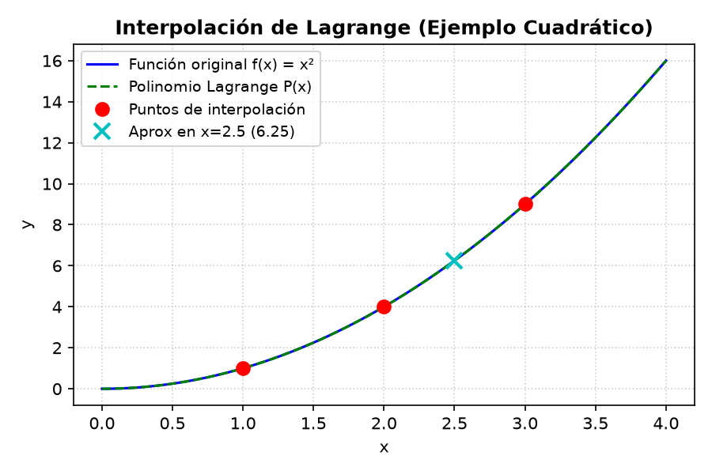

<h1 align="center"><b>INFORME - INTERPOLACIÓN DE LAGRANGE</b></h1>

<p align="justify">
Este informe detalla el estudio teórico y la implementación computacional del método de interpolación de Lagrange para la aproximación polinomial de funciones y datos tabulares. Este trabajo forma parte del proyecto de la asignatura de Programación Numérica.
</p>

---

## **1. Reseña del Método**

### **Origen y Autor**
<p align="justify">
El método de interpolación de Lagrange debe su nombre al matemático ítalo-francés <b>Joseph-Louis Lagrange</b> (1736–1813), quien lo publicó en su obra de 1795. Sin embargo, históricamente no fue el primero en descubrir esta formulación. El matemático inglés <b>Edward Waring</b> la descubrió originalmente en 1779, y el prolífico matemático suizo <b>Leonhard Euler</b> la redescubrió de manera independiente en 1783. A pesar de esto, la sencillez y elegancia con la que Lagrange presentó la fórmula en sus lecciones en la <i>École Normale</i> consagró su nombre en la historia de los métodos numéricos.
</p>

### **Fundamentos Matemáticos**
<p align="justify">
Dado un conjunto de $n+1$ puntos de datos bidimensionales $(x_0, y_0), (x_1, y_1), \dots, (x_n, y_n)$, donde todas las abscisas $x_i$ son distintas entre sí, existe un único polinomio $P(x)$ de grado a lo sumo $n$ que pasa exactamente por todos ellos. Es decir, cumple la condición de interpolación:
$$P(x_i) = y_i \quad \text{para todo } i = 0, 1, \dots, n$$
</p>

<p align="justify">
La formulación de Lagrange construye este polinomio único directamente como una combinación lineal de los valores de las ordenadas $y_i$, ponderados por un conjunto de polinomios bases de Lagrange, denotados como $L_i(x)$:
$$P(x) = \sum_{i=0}^{n} y_i \cdot L_i(x)$$
</p>

<p align="justify">
Cada polinomio base de Lagrange $L_i(x)$ es de grado $n$ y se define mediante el producto continuo (productoria):
$$L_i(x) = \prod_{\substack{j=0 \\ j \neq i}}^{n} \frac{x - x_j}{x_i - x_j} = \frac{(x - x_0)(x - x_1)\cdots(x - x_{i-1})(x - x_{i+1})\cdots(x - x_n)}{(x_i - x_0)(x_i - x_1)\cdots(x_i - x_{i-1})(x_i - x_{i+1})\cdots(x_i - x_n)}$$
</p>

<p align="justify">
<b>Propiedad Fundamental (Delta de Kronecker):</b>
Las bases $L_i(x)$ poseen una propiedad matemática crucial:
$$L_i(x_j) = \delta_{ij} = \begin{cases} 1 & \text{si } i = j \\ 0 & \text{si } i \neq j \end{cases}$$
Esta propiedad asegura que al evaluar el polinomio completo $P(x)$ en cualquier punto conocido $x_k$, todos los términos de la sumatoria se anulan excepto aquel para el cual $i = k$, resultando en $P(x_k) = y_k \cdot 1 = y_k$.
</p>

### **Convergencia y Error**
<p align="justify">
Si los datos provienen de una función continua $f(x)$ que posee $n+1$ derivadas en un intervalo cerrado $[a, b]$ que contiene a todos los nodos de interpolación, entonces para cualquier $x \in [a, b]$ existe un valor $\xi(x) \in (a, b)$ tal que el error de truncamiento de la interpolación viene dado por:
$$E(x) = f(x) - P(x) = \frac{f^{(n+1)}(\xi(x))}{(n+1)!} \prod_{i=0}^{n} (x - x_i)$$
</p>

<p align="justify">
A primera vista, se podría asumir intuitivamente que aumentar el número de puntos de datos (y con ello el grado $n$ del polinomio) mejoraría la precisión y convergería a la función real. Sin embargo, si los nodos están uniformemente espaciados, esto no siempre ocurre. Este comportamiento se conoce como el <b>Fenómeno de Runge</b>, que consiste en la aparición de oscilaciones severas en los extremos del intervalo para ciertas funciones analíticas (por ejemplo, la función de Runge $f(x) = \frac{1}{1 + 25x^2}$).
</p>

<p align="justify">
Para garantizar la convergencia a medida que $n \to \infty$, es necesario seleccionar un espaciamiento de puntos no uniforme que disminuya la densidad en el centro y la aumente cerca de los bordes del intervalo. La distribución óptima se logra utilizando las proyecciones de los puntos de un semicírculo, conocidos como los <b>Nodos de Chebyshev</b>.
</p>

---

## **2. Manual de Usuario**

<p align="justify">
La interfaz gráfica de usuario (GUI) del programa ha sido desarrollada utilizando la librería moderna <b>CustomTkinter</b>, ofreciendo una experiencia visual fluida y atractiva con soporte nativo de modo oscuro. A continuación se detallan los pasos para ejecutar la simulación de Interpolación de Lagrange:
</p>

### **Pasos para la Ejecución**
1. **Inicialización**: Abra una terminal en la raíz del proyecto y ejecute el comando:
   ```bash
   python main.py
   ```
2. **Navegación**: En el menú lateral izquierdo de la aplicación, haga clic en el botón **Interpolación de Lagrange** para cargar la vista correspondiente.
3. **Ingreso de Datos**: En el panel de configuración (izquierdo):
   - **$x$ (comas):** Ingrese la lista de valores de las abscisas separados por comas (por ejemplo: `1.0, 2.0, 3.0`).
   - **$y$ (comas):** Ingrese la lista de valores de las ordenadas correspondientes separados por comas (por ejemplo: `1.0, 4.0, 9.0`). *Nota: La cantidad de elementos en $x$ e $y$ debe ser idéntica y mayor o igual a 2.*
   - **Evaluar en $x$:** Ingrese el punto numérico exacto en el cual desea estimar el valor del polinomio interpolante (por ejemplo: `2.5`).
   - **$f(x)$ opcional:** Si conoce la función analítica matemática de la cual provienen los datos, puede ingresarla usando sintaxis matemática estándar de Python/Sympy (por ejemplo: `x**2` o `sin(x)`) para realizar la verificación analítica del error.
4. **Presets / Ejemplos**: Alternativamente, puede seleccionar un ejemplo del menú desplegable **Ejemplo** (como *Recta (2 pts)*, *x² (3 pts)* o *sen(x) (5 pts)*) y los campos se rellenarán automáticamente.
5. **Cálculo y Gráfica**: Presione el botón **Calcular y Graficar**.
6. **Interpretación de Pestañas (Panel Derecho)**:
   - **Resultado**: Muestra el valor interpolado $P(x)$, la representación algebraica expandida del polinomio y, si se suministró la función real, el valor exacto y el error relativo porcentual.
   - **Paso a Paso**: Detalla la fórmula simbólica de cada base $L_i(x)$ y su evaluación paso a paso para el punto seleccionado.
   - **Gráfica**: Muestra el gráfico generado con Matplotlib, graficando los nodos originales (puntos rojos), la aproximación en el punto de evaluación (cruz cian), el polinomio interpolado (línea verde discontinua) y la función real (línea azul continua si se suministró).

---

## **3. Código de la Implementación**

El módulo matemático puro del método se encuentra en [lagrange_interpolation.py](file:///c:/Users/srish/hanu/Metodos-numericos---Programacion-Numerica-2026-1/lib/lagrange_interpolation.py). A continuación se incluye el código en su totalidad:

```python
# Módulo de copia profunda para evitar modificar las listas origiciales que
# entrega el llamador. Se usa copy.deepcopy porque las listas pueden contener
# valores anidados (matrices) y deepcopy replica de forma recursiva.
import copy

# SymPy: librería de matemática simbólica. Permite construir el polinomio
# de Lagrange como expresión algebraica (no solo numérica), expandirlo a su
# forma estándar de potencias y evaluarlo en cualquier punto.
# Documentación: https://docs.sympy.org/
import sympy


class LagrangeInterpolation:
    """
    Clase que implementa el método de Interpolación de Lagrange.

    Dados n+1 puntos (x_0,y_0),...,(x_n,y_n) construye el único polinomio de
    grado n que pasa por todos ellos. La fórmula es:

        P(x) = Σ_{i=0}^{n} y_i · L_i(x)

    donde cada L_i(x) es la i-ésima base de Lagrange:

        L_i(x) = Π_{j=0, j≠i}^{n} (x - x_j) / (x_i - x_j)

    Propiedades de la base: L_i(x_i) = 1 y L_i(x_j) = 0 para i ≠ j, lo que
    garantiza que P(x_i) = y_i (el polinomio pasa por todos los datos).

    La clase entrega:
    - El polinomio expandido como expresión simbólica de sympy.
    - La evaluación numérica del polinomio en un punto específico.
    - El paso a paso detallado (lista de diccionarios) para visualización
      posterior en la interfaz gráfica.
    """

    def __init__(self, x, y, eval_point):
        """
        Inicializa el interpolador con los puntos conocidos y el punto a evaluar.

        Parámetros:
        - x: lista de valores x (puntos conocidos, abscisas).
        - y: lista de valores y (puntos conocidos, ordenadas).
        - eval_point: valor numérico donde se evaluará el polinomio P(x).
        """
        # Copia profunda de las listas para no alterar las originales del
        # llamador aunque más adelante se modifiquen internamente.
        self.x = copy.deepcopy(x)
        self.y = copy.deepcopy(y)
        # Punto de evaluación (escalar, no requiere copia profunda).
        self.eval_point = eval_point
        # Número de puntos de datos. El polinomio resultante será de grado n-1.
        self.n = len(x)
        # Lista donde se acumulan los pasos del algoritmo para la GUI.
        # Se reinicia al inicio de solve() para que cada llamada sea idempotente.
        self.steps = []

    def solve(self):
        """
        Ejecuta la interpolación de Lagrange.

        Retorna un diccionario con la misma estructura que GaussSimple:
        - success: bool, indica si el cálculo terminó correctamente.
        - solution: dict con los resultados (value, symbolic_value, polynomial,
          polynomial_expr, basis) o None si hubo error.
        - steps: lista de diccionarios describiendo cada paso del algoritmo.
        - error_message: mensaje de error en español o None si todo salió bien.
        """
        # Reiniciar pasos: garantiza que llamadas repetidas a solve() partan
        # de cero y no acumulen pasos de ejecuciones anteriores.
        self.steps = []

        # ---------------------------------------------------------------
        # VALIDACIONES DE ENTRADA
        # Se validan antes de any cálculo para fallar rápido con mensajes
        # claros en lugar de producir excepciones crípticas más adelante.
        # ---------------------------------------------------------------

        # 1. x e y deben tener la misma cantidad de elementos.
        # Sin esto, no se puede formar un conjunto coherente de puntos (x,y).
        if len(self.x) != len(self.y):
            return {
                "success": False,
                "solution": None,
                "steps": self.steps,
                "error_message": f"Dimensiones incompatibles: x tiene {len(self.x)} elementos e y tiene {len(self.y)} elementos.",
            }

        # 2. Se necesitan al menos 2 puntos: con 1 punto no se puede definir
        # un polinomio interpolante (grado mínimo 1 = recta con 2 puntos).
        if self.n < 2:
            return {
                "success": False,
                "solution": None,
                "steps": self.steps,
                "error_message": "Se requieren al menos 2 puntos para construir el polinomio de interpolación.",
            }

        # 3. Los valores de x deben ser distintos entre sí.
        # Si existiera un valor x duplicado, el denominador (x_i - x_j) sería
        # cero y se generaría una división indeterminada => error matemático.
        # Se usa una tolerancia 1e-12 para comparar floats por posibles
        # errores de redondeo.
        for i in range(self.n):
            for j in range(i + 1, self.n):
                if abs(self.x[i] - self.x[j]) < 1e-12:
                    return {
                        "success": False,
                        "solution": None,
                        "steps": self.steps,
                        "error_message": f"Los valores de x deben ser distintos. Se encontró un valor duplicado: x[{i}] = x[{j}] = {self.x[i]}.",
                     }

        # ---------------------------------------------------------------
        # REGISTRO DEL ESTADO INICIAL
        # Primer paso mostrado en la GUI: resumen de los datos de entrada.
        # Se copian de nuevo las listas para que la GUI muestre los datos
        # tal cual entraron y no una referencia mutable.
        # ---------------------------------------------------------------
        self.steps.append({
            "type": "initial",
            "x": copy.deepcopy(self.x),
            "y": copy.deepcopy(self.y),
            "eval_point": self.eval_point,
            "description": f"Datos de entrada: {self.n} puntos. Punto de evaluación x = {self.eval_point}."
        })

        # ---------------------------------------------------------------
        # CONSTRUCCIÓN SIMBÓLICA DEL POLINOMIO
        # Se construye P(x) usando sympy para obtener una expresión algebraica
        # que la GUI puede mostrar como texto (ej: "x**2 + 2*x - 1").
        # ---------------------------------------------------------------

        # Símbolo de variable: representa x en la expresión simbólica.
        # Se usará en los productos (x - x_j) de cada base L_i.
        x_sym = sympy.Symbol('x')
        # Acumulador de la expresión simbólica del polinomio completo.
        # Parte de 0 y se le suman y_i * L_i(x).
        poly_expr = 0
        # Lista donde se guardan las n bases L_i(x) por separado (expresiones
        # sympy sin simplificar). Servirá para que la GUI muestre cada base.
        basis_exprs = []

        # Para cada punto i, construir su base L_i(x) y sumar y_i*L_i al total.
        for i in range(self.n):
            # Numerador: Π_{j≠i} (x - x_j). Empieza en 1 (elemento neutro del
            # producto) y se van multiplicando los términos lineales.
            numerator = 1
            # Denominador: Π_{j≠i} (x_i - x_j). Es una constante (no depende de
            # x) que normaliza la base para que L_i(x_i) = 1.
            denominator = 1
            for j in range(self.n):
                # Se excluye j=i porque (x_i - x_i) = 0 haría el producto cero.
                if i != j:
                    numerator *= (x_sym - self.x[j])
                    denominator *= (self.x[i] - self.x[j])
            # Base de Lagrange L_i(x) = numerador / denominador.
            L_i = numerator / denominator
            # Guardar la base para referencia externa (GUI/tests).
            basis_exprs.append(L_i)
            # Acumular el término y_i * L_i(x) en el polinomio total.
            poly_expr += self.y[i] * L_i

        # Expandir el polinomio: sympy lo reorganiza a la forma estándar de
        # potencias de x (ej: del producto (x-1)(x-2) pasa a x**2 - 3*x + 2).
        # Esto facilita la lectura por el usuario y la comparación con un
        # polinomio esperado.
        poly_expanded = sympy.expand(poly_expr)
        # Representación en texto para mostrar en la GUI / logs.
        poly_str = str(poly_expanded)

        # ---------------------------------------------------------------
        # EVALUACIÓN NUMÉRICA PASO A PASO
        # Sigue el pseudocódigo Lagrng(x, y, n, x) provisto en
        # docs/pseudocode/lagrange_interpolation.txt.
        # Se calcula P(eval_point) con doble bucle: para cada i se calcula el
        # producto de y_i por todos los cocientes (eval_point - x_j)/(x_i - x_j),
        # y luego se suman todos esos productos.
        # Cada subpaso se registra en self.steps para que la GUI lo muestre.
        # ---------------------------------------------------------------

        # Acumulador de la suma total Σ y_i * L_i(eval_point).
        sum_val = 0.0

        # Bucle exterior: recorre cada base i.
        for i in range(self.n):
            # product arranca en y_i (el coeficiente del término actual).
            # Observación: en el pseudocódigo "product = yi" porque el
            # producto empieza valiendo y_i y luego se multiplica por los
            # cocientes correspondientes.
            product = float(self.y[i])
            # Registrar el inicio del cálculo de la base i-ésima.
            self.steps.append({
                "type": "basis_start",
                "i": i,
                "description": f"Cálculo de L_{i}(x) · y_{i}:"
            })

            # Bucle interior: recorre cada j para multiplicar el cociente
            # correspondiente al término (x - x_j)/(x_i - x_j) con j ≠ i.
            for j in range(self.n):
                if i != j:
                    # Numerador del cociente: (eval_point - x_j).
                    factor_num = (self.eval_point - self.x[j])
                    # Denominador del cociente: (x_i - x_j) (constante).
                    factor_den = (self.x[i] - self.x[j])
                    # Valor del cociente completo.
                    term_val = factor_num / factor_den
                    # Acumular el cociente en el producto del término i.
                    product *= term_val
                    # Registrar detalle del término j para la GUI.
                    self.steps.append({
                        "type": "term",
                        "i": i,
                        "j": j,
                        "term": f"(x - {self.x[j]}) / ({self.x[i]} - {self.x[j]})",
                        "term_value": term_val,
                        "product_so_far": product,
                        "description": f"Término j={j}: ({self.eval_point} - {self.x[j]}) / ({self.x[i]} - {self.x[j]}) = {term_val:.6g}"
                    })

            # Fin del cálculo de la base i: product = y_i * L_i(eval_point).
            # li_value aísla L_i(eval_point) dividiendo product por y_i
            # (salvo cuando y_i = 0, en cuyo caso L_i es 0 por convención).
            li_value = float(product) / float(self.y[i]) if float(self.y[i]) != 0 else 0.0
            self.steps.append({
                "type": "basis_end",
                "i": i,
                "li_value": li_value,
                "product_value": product,
                "description": f"L_{i}({self.eval_point}) = {li_value:.6g} | y_{i} · L_{i} = {product:.6g}"
            })
            # Acumular el término en la suma total.
            sum_val += product

        # ---------------------------------------------------------------
        # PASO FINAL: suma y presentación del polinomio
        # ---------------------------------------------------------------

        # Registrar la suma final con el resultado numérico.
        self.steps.append({
            "type": "sum",
            "description": f"Suma de todos los términos: P({self.eval_point}) = Σ y_i · L_i({self.eval_point})",
            "result": sum_val
        })

        # Registrar el polinomio expandido como texto para la GUI.
        self.steps.append({
            "type": "polynomial",
            "polynomial": poly_str,
            "description": "Polinomio de Lagrange expandido:"
        })

        # ---------------------------------------------------------------
        # VERIFICACIÓN SIMBÓLICA
        # Se reevalúa el polinomio expandido con sympy en el mismo punto
        # usando subs(). Sirve como verificación cruzada: el valor obtenido
        # por la ruta numérica (sum_val) debe coincidir con el de la ruta
        # simbólica (symbolic_eval). Si difieren, hay un bug en la lógica.
        # ---------------------------------------------------------------
        symbolic_eval = float(poly_expanded.subs(x_sym, self.eval_point))

        # ---------------------------------------------------------------
        # RESULTADO
        # ---------------------------------------------------------------
        return {
            "success": True,
            "solution": {
                # Valor numérico calculado paso a paso (ruta pseudocódigo).
                "value": sum_val,
                # Valor numérico calculado desde la expresión simbólica.
                "symbolic_value": symbolic_eval,
                # Polinomio expandido como string legible.
                "polynomial": poly_str,
                # Expresión sympy cruda (objeto Expr) para uso avanzado.
                "polynomial_expr": poly_expanded,
                # Lista con las n bases L_i(x) como expresiones sympy.
                "basis": basis_exprs,
            },
            "steps": self.steps,
            "error_message": None
        }
```

---

## **4. Resultados de la Implementación**

### **Ejemplo de Ejecución**
<p align="justify">
Para validar el funcionamiento del algoritmo de Lagrange, se ingresó el preset cuadrático:
- **Nodos:** $x = [1.0, 2.0, 3.0]$
- **Valores conocidos:** $y = [1.0, 4.0, 9.0]$ (provenientes del modelo $f(x) = x^2$)
- **Punto a evaluar:** $x = 2.5$
</p>

#### **Gráfica Resultante**
La siguiente gráfica muestra el comportamiento del polinomio interpolante obtenido:



#### **Salida Detallada Paso a Paso**
A continuación se muestra la salida numérica paso a paso registrada por el resolvedor:

```
Datos de entrada: 3 puntos. Punto de evaluación x = 2.5.

Cálculo de base L_0(x) * y_0:
  - Término j=1: (2.5 - 2.0) / (1.0 - 2.0) = -0.5
  - Término j=2: (2.5 - 3.0) / (1.0 - 3.0) = 0.25
  → L_0(2.5) = -0.125 | y_0 · L_0 = -0.125

Cálculo de base L_1(x) * y_1:
  - Término j=0: (2.5 - 1.0) / (2.0 - 1.0) = 1.5
  - Término j=2: (2.5 - 3.0) / (2.0 - 3.0) = 0.5
  → L_1(2.5) = 0.75 | y_1 · L_1 = 3

Cálculo de base L_2(x) * y_2:
  - Término j=0: (2.5 - 1.0) / (3.0 - 1.0) = 0.75
  - Término j=1: (2.5 - 2.0) / (3.0 - 2.0) = 0.5
  → L_2(2.5) = 0.375 | y_2 · L_2 = 3.375

Suma final:
  P(2.5) = -0.125 + 3.000 + 3.375 = 6.25000000
  Polinomio obtenido expandido: x**2
```

---

## **5. Tabla de Comandos del Software Utilizado**

<p align="justify">
Para complementar el desarrollo a medida, se presenta una tabla de equivalencias con las funciones nativas provistas por las librerías científicas del ecosistema Python (Numpy/Scipy) en comparación con el entorno Matlab/Octave.
</p>

| Área Numérica | Operación | Comando en Python (Numpy/Scipy/Sympy) | Comando en Matlab / Octave |
| :--- | :--- | :--- | :--- |
| **Cálculo de Raíces** | Bisección | `scipy.optimize.bisect(f, a, b)` | `fzero(f, [a, b])` |
| | Newton-Raphson | `scipy.optimize.newton(f, x0, fprime)` | `fzero(f, x0)` o scripts personalizados |
| | Secante | `scipy.optimize.newton(f, x0)` (sin derivada) | `fzero(f, [x0, x1])` |
| **Sistemas Lineales** | Gauss Simple/Pivoteo | `numpy.linalg.solve(A, b)` | `A \ b` (operador barra invertida) |
| | Gauss-Seidel | Resolvedores iterativos en `scipy.sparse.linalg` | Scripts a medida o resolvedores iterativos |
| **Interpolación** | Lagrange | `scipy.interpolate.lagrange(x, y)` | `polyfit(x, y, n)` o `interp1` |
| | Newton / Baricéntrica | `scipy.interpolate.BarycentricInterpolator(x, y)` | Polinomios de Newton personalizados |
| **Integración Numérica**| Regla del Trapecio | `scipy.integrate.trapezoid(y, x)` | `trapz(x, y)` o `trapz(y)` |

### **Ejemplo de Implementación Nativa en Python**
El siguiente bloque de código ilustra cómo realizar la interpolación de Lagrange utilizando la librería científica `scipy` en una sola línea de ejecución:

```python
import numpy as np
from scipy.interpolate import lagrange

# Definir puntos de datos conocidos
x = np.array([1.0, 2.0, 3.0])
y = np.array([1.0, 4.0, 9.0])

# Generar el polinomio de Lagrange
poly = lagrange(x, y)

# Evaluar el polinomio en x = 2.5
valor_evaluado = poly(2.5)
print("Coeficientes del polinomio (orden descendente):", poly.coefficients)
print("Evaluación en x=2.5:", valor_evaluado)
```

---

## **6. Referencias**

1. Chapra, S. C., & Canale, R. P. (2015). *Métodos Numéricos para Ingenieros* (7ma ed.). México: McGraw-Hill.
2. Burden, R. L., & Faires, J. D. (2002). *Análisis Numérico* (7ma ed.). Bogotá: Thomson Learning.
3. SciPy Developer Community. (2026). *SciPy Optimization and Interpolation Reference Guide*. Recuperado de [https://docs.scipy.org/](https://docs.scipy.org/)
4. SymPy Development Team. (2026). *SymPy 1.12 Documentation*. Recuperado de [https://docs.sympy.org/](https://docs.sympy.org/)
