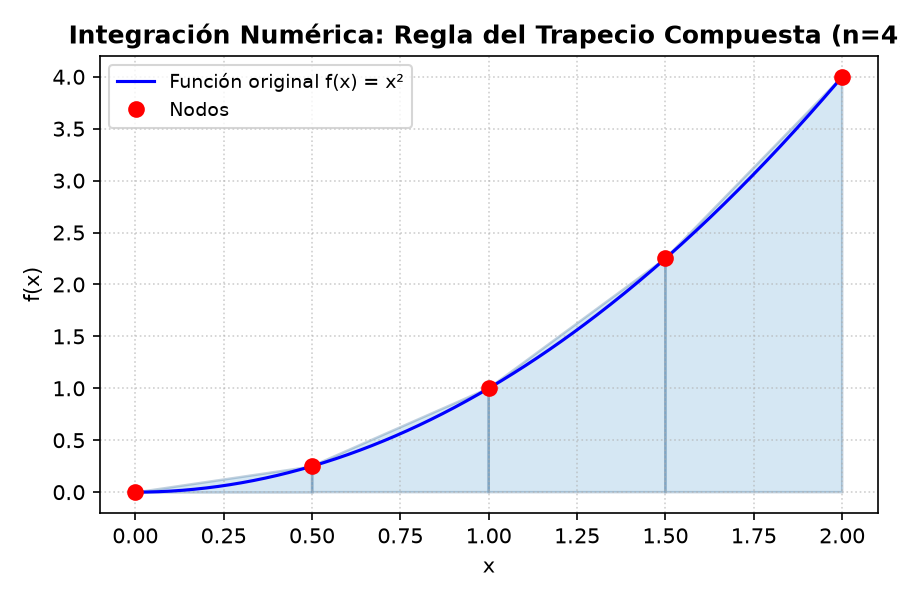

<h1 align="center"><b>INFORME - REGLA DEL TRAPECIO (SIMPLE Y COMPUESTA)</b></h1>

<p align="justify">
Este informe detalla el estudio teórico y la implementación computacional del método de integración numérica conocido como la Regla del Trapecio, tanto en su variante simple como compuesta. Este trabajo forma parte del proyecto de la asignatura de Programación Numérica.
</p>

---

## **1. Reseña del Método**

### **Origen y Autor**
<p align="justify">
La regla del trapecio pertenece al grupo de las <b>fórmulas de integración numérica de Newton-Cotes</b>, cuyo nombre rinde homenaje a dos grandes figuras de la matemática y la física: <b>Sir Isaac Newton</b> (1643–1727) y <b>Roger Cotes</b> (1682–1716). A finales del siglo XVII e inicios del XVIII, ambos trabajaron en aproximar integrales de funciones difíciles o desconocidas a partir de polinomios de interpolación evaluados en nodos igualmente espaciados. La regla del trapecio representa el caso de Newton-Cotes de grado 1, donde la función se aproxima localmente por un polinomio lineal (rectas secantes).
</p>

### **Fundamentos Matemáticos**
<p align="justify">
La integración numérica busca aproximar el valor de la integral definida de una función continua $f(x)$ en un intervalo cerrado $[a, b]$:
$$I = \int_{a}^{b} f(x) \, dx$$
La regla del trapecio propone sustituir la curva real de $f(x)$ por una línea recta que une los puntos extremos $(a, f(a))$ y $(b, f(b))$, formando un trapecio geométrico cuya área es una aproximación de la integral.
</p>

#### **a) Regla del Trapecio Simple ($n = 1$ segmento)**
<p align="justify">
Si dividimos el intervalo en un único segmento de ancho $h = b - a$, el área aproximada es el área del trapecio resultante:
$$I \approx Trap(h, f(a), f(b)) = h \cdot \frac{f(a) + f(b)}{2}$$
</p>

#### **b) Regla del Trapecio Compuesta ($n > 1$ segmentos)**
<p align="justify">
Cuando el intervalo $[a, b]$ es grande, una aproximación lineal simple suele introducir un error inaceptable. Para remediarlo, el intervalo $[a, b]$ se subdivide en $n$ subintervalos de igual ancho constante:
$$h = \frac{b - a}{n}$$
Definiendo los nodos espaciados de forma uniforme como $x_i = a + i \cdot h$ (para $i = 0, 1, \dots, n$, donde $x_0 = a$ y $x_n = b$), aplicamos la regla del trapecio simple a cada subintervalo $[x_i, x_{i+1}]$ y sumamos las áreas individuales. Esto resulta en la fórmula compuesta:
$$I \approx \sum_{i=0}^{n-1} \frac{h}{2} \left[ f(x_i) + f(x_{i+1}) \right] = \frac{h}{2} \left[ f(x_0) + 2 \sum_{i=1}^{n-1} f(x_i) + f(x_n) \right]$$
El factor 2 aparece porque cada nodo intermedio $x_i$ (para $i = 1, \dots, n-1$) es compartido por dos trapecios adyacentes y, por tanto, se acumula dos veces en la sumatoria.
</p>

### **Convergencia y Análisis de Error**
<p align="justify">
Si la función $f(x)$ posee una segunda derivada continua $f''(x)$ en el intervalo de integración, el error de truncamiento global de la regla del trapecio compuesta es:
$$E = -\frac{(b - a) \cdot h^2}{12} \cdot f''(\xi)$$
para algún valor desconocido $\xi \in (a, b)$.
</p>

<p align="justify">
<b>Propiedades del Error:</b>
1. **Exactitud para Funciones Lineales**: Dado que el error depende de la segunda derivada $f''(x)$, si la función es un polinomio de grado $\le 1$ (función lineal o constante), entonces $f''(x) = 0$, lo que implica que el error es exactamente cero. La regla del trapecio es exacta para rectas.
2. **Orden de Convergencia**: El error global disminuye con el cuadrado del tamaño de paso $h$ ($O(h^2)$). Si duplicamos el número de segmentos (reduciendo $h$ a la mitad), el error de la integral aproximada se reduce teóricamente en un factor de 4 (es decir, a la cuarta parte).
</p>

---

## **2. Manual de Usuario**

<p align="justify">
La interfaz gráfica de usuario (GUI) del programa ha sido desarrollada utilizando la librería moderna <b>CustomTkinter</b>. A continuación se detallan los pasos para ejecutar la integración numérica usando la Regla del Trapecio:
</p>

### **Pasos para la Ejecución**
1. **Inicialización**: Abra una terminal en la raíz del proyecto y ejecute el comando:
   ```bash
   python main.py
   ```
2. **Navegación**: En el menú lateral izquierdo de la aplicación, haga clic en el botón **Regla del Trapecio** para cargar la vista correspondiente.
3. **Ingreso de Datos**: En el panel de configuración (izquierdo):
   - **$x$ (comas):** Ingrese la lista de nodos uniformemente espaciados separados por comas (por ejemplo: `0.0, 0.5, 1.0, 1.5, 2.0`). *Nota: Los valores deben ser estrictamente crecientes y poseer un espaciamiento constante $h$.*
   - **$f(x)$ (comas):** Ingrese los valores de la función evaluada en cada nodo correspondientes separados por comas (por ejemplo: `0.0, 0.25, 1.0, 2.25, 4.0`).
   - **$f(x)$ opcional:** Opcionalmente, ingrese la expresión matemática simbólica de la función continua (por ejemplo: `x**2` o `sin(x)`) para comparar contra el resultado analítico exacto y calcular el error relativo porcentual.
4. **Presets / Ejemplos**: Alternativamente, puede seleccionar un ejemplo del menú desplegable **Ejemplo** (como *Lineal (2 pts)*, *Constante (3 pts)* o *x² (5 pts)*) y los campos se rellenarán automáticamente.
5. **Cálculo y Gráfica**: Presione el botón **Calcular y Graficar**.
6. **Interpretación de Pestañas (Panel Derecho)**:
   - **Resultado**: Muestra el valor de la integral aproximada ($I \approx \dots$), el paso $h$ calculado, el número de segmentos $n$, el valor analítico exacto (si aplica), el error relativo porcentual y la fórmula general expandida con los coeficientes numéricos de la sumatoria.
   - **Paso a Paso**: Detalla el área parcial de cada trapecio intermedio y la suma acumulada secuencialmente.
   - **Gráfica**: Muestra el gráfico generado con Matplotlib, dibujando cada trapecio individual relleno con un color semitransparente azul y borde azul oscuro, junto con la curva continua azul de la función real (si se ingresó).

---

## **3. Código de la Implementación**

El módulo matemático puro de la Regla del Trapecio se encuentra en [trapezoidal_rule.py](file:///c:/Users/srish/hanu/Metodos-numericos---Programacion-Numerica-2026-1/lib/trapezoidal_rule.py). A continuación se incluye el código en su totalidad:

```python
"""
Módulo de la Regla del Trapecio (simple y compuesta).

Implementa la integración numérica de datos tabulares siguiendo el
pseudocódigo de Chapra (docs/pseudocode/trapezoidal_rule.txt):

    a) Un solo segmento:
        Trap(h, f0, f1) = h * (f0 + f1) / 2

    b) Segmentos múltiples:
        Trapm(h, n, f) = h * (f0 + 2*Σ_{i=1}^{n-1} f_i + fn) / 2

Ambas fórmulas asumen nodos uniformemente espaciados (h constante).
La clase detecta automáticamente el número de segmentos n = len(x) - 1 y
ramifica al caso simple (n == 1) o compuesto (n > 1).

Si se provee una expresión simbólica `f_expr`, se calcula la integral
exacta con sympy para comparar contra la aproximación y reportar el
error relativo (análisis de error al estilo Chapra).
"""
import copy

# SymPy: librería de matemática simbólica. Se usa para calcular la
# integral analítica exacta cuando se provee f_expr, permitiendo
# comparar contra la aproximación numérica.
# Documentación: https://docs.sympy.org/
import sympy


class TrapezoidalRule:
    """
    Clase que implementa la regla del trapecio (simple y compuesta).

    Dados n+1 puntos (x_0, f_0), ..., (x_n, f_n) igualmente espaciados,
    calcula la integral aproximada de la función subyacente en [a, b].
    El número de segmentos es n = len(x) - 1.

    Casos:
    - n == 1 (2 puntos): Trap(h, f0, f1) = h*(f0 + f1)/2
    - n > 1 (más puntos): Trapm(h, n, f) = h*(f0 + 2*Σf_i + fn)/2

    La clase entrega:
    - El valor aproximado de la integral.
    - El paso h y el número de segmentos n.
    - El paso a paso detallado (lista de diccionarios) para la GUI.
    - Opcionalmente, la integral exacta (vía sympy) y el error relativo
      cuando se provee f_expr.
    """

    def __init__(self, x, y, f_expr=None):
        """
        Inicializa el integrador con los puntos tabulares conocidos.

        Parámetros:
        - x: lista de valores x (nodos, deben ser estrictamente
          crecientes y uniformemente espaciados).
        - y: lista de valores f(x) en cada nodo (mismo largo que x).
        - f_expr: string con expresión sympy de la función original
          (opcional). Se usa para calcular la integral exacta y el
          error relativo. Si es None o no se puede evaluar, simplemente
          se omite la comparación analítica.
        """
        # Copia profunda para no alterar las listas originales del
        # llamador aunque más adelante se modifiquen internamente.
        self.x = copy.deepcopy(x)
        self.y = copy.deepcopy(y)
        # Expresión simbólica opcional (string como "x**2" o "sin(x)").
        self.f_expr = f_expr
        # Número de segmentos: con n+1 puntos hay n segmentos.
        self.n = len(x) - 1 if len(x) >= 1 else 0
        # Lista donde se acumulan los pasos del algoritmo para la GUI.
        # Se reinicia al inicio de solve() para que cada llamada sea
        # idempotente.
        self.steps = []

    # ------------------------------------------------------------------
    # Pseudocódigo a) — Trap (un solo segmento)
    # ------------------------------------------------------------------
    def _trap_simple(self, h, f0, f1):
        """
        Regla del trapecio para un solo segmento.

            Trap(h, f0, f1) = h * (f0 + f1) / 2

        Corresponde al pseudocódigo (a) de Chapra. Geométricamente es
        el área del trapecio de altura h y bases f0, f1.
        """
        return h * (f0 + f1) / 2.0

    # ------------------------------------------------------------------
    # Pseudocódigo b) — Trapm (segmentos múltiples)
    # ------------------------------------------------------------------
    def _trap_composite(self, h, f):
        """
        Regla del trapecio compuesta para n segmentos.

            Trapm(h, n, f) = h * (f0 + 2*Σ_{i=1}^{n-1} f_i + fn) / 2

        Corresponde al pseudocódigo (b) de Chapra. Acumula f0, luego
        suma 2*f_i para los puntos intermedios, y finalmente fn.
        El factor 2 aparece porque cada punto interior pertenece a dos
        trapecios adyacentes.
        """
        n = self.n
        # Acumulador: empieza con f0 (extremo izquierdo, coeficiente 1).
        sum_val = float(f[0])
        # Bucle sobre los puntos interiores i = 1 .. n-1 (coeficiente 2).
        for i in range(1, n):
            sum_val += 2.0 * float(f[i])
        # Extremo derecho fn (coeficiente 1).
        sum_val += float(f[n])
        # Multiplica por h/2 para obtener la integral aproximada.
        return h * sum_val / 2.0

    # ------------------------------------------------------------------
    # Método principal
    # ------------------------------------------------------------------
    def solve(self):
        """
        Ejecuta la integración numérica con la regla del trapecio.

        Retorna un diccionario con la misma estructura que GaussSimple
        y LagrangeInterpolation:
        - success: bool, indica si el cálculo terminó correctamente.
        - solution: dict con los resultados (value, h, n, exact_value,
          error_relativo, segments, formula) o None si hubo error.
        - steps: lista de diccionarios describiendo cada paso del
          algoritmo para visualización en la GUI.
        - error_message: mensaje de error en español o None si todo
          salió bien.
        """
        # Reiniciar pasos: garantiza idempotencia entre llamadas.
        self.steps = []

        # ---------------------------------------------------------------
        # VALIDACIONES DE ENTRADA
        # Se validan antes de cualquier cálculo para fallar rápido con
        # mensajes claros en lugar de producir resultados erróneos.
        # ---------------------------------------------------------------

        # 1. x e y deben tener la misma cantidad de elementos.
        if len(self.x) != len(self.y):
            return {
                "success": False,
                "solution": None,
                "steps": self.steps,
                "error_message": (
                    f"Dimensiones incompatibles: x tiene "
                    f"{len(self.x)} elementos e y tiene "
                    f"{len(self.y)} elementos."
                ),
            }

        # 2. Se necesitan al menos 2 puntos (n >= 1 segmento).
        if len(self.x) < 2:
            return {
                "success": False,
                "solution": None,
                "steps": self.steps,
                "error_message": (
                    "Se requieren al menos 2 puntos para aplicar la "
                    "regla del trapecio (n >= 1 segmento)."
                ),
            }

        # 3. x debe ser estrictamente creciente (senso único del eje).
        for i in range(len(self.x) - 1):
            if self.x[i + 1] <= self.x[i]:
                return {
                    "success": False,
                    "solution": None,
                    "steps": self.steps,
                    "error_message": (
                        f"Los valores de x deben ser estrictamente "
                        f"crecientes. Se encontró x[{i}] = "
                        f"{self.x[i]} >= x[{i + 1}] = {self.x[i + 1]}."
                    ),
                }

        # 4. Nodos uniformemente espaciados (h constante). El
        # pseudocódigo de Chapra asume h constante; la fórmula
        # compuesta es incorrecta si los nodos no son uniformes.
        h = float(self.x[1]) - float(self.x[0])
        for i in range(len(self.x) - 1):
            h_i = float(self.x[i + 1]) - float(self.x[i])
            if abs(h_i - h) >= 1e-9:
                return {
                    "success": False,
                    "solution": None,
                    "steps": self.steps,
                    "error_message": (
                        f"La regla del trapecio requiere nodos "
                        f"uniformemente espaciados. h[0] = {h:.6g} "
                        f"pero h[{i}] = {h_i:.6g}."
                    ),
                }

        n = self.n

        # ---------------------------------------------------------------
        # REGISTRO DEL ESTADO INICIAL
        # Primer paso mostrado en la GUI: resumen de los datos de
        # entrada, h y n.
        # ---------------------------------------------------------------
        self.steps.append({
            "type": "initial",
            "x": copy.deepcopy(self.x),
            "y": copy.deepcopy(self.y),
            "h": h,
            "n": n,
            "description": (
                f"Datos de entrada: {len(self.x)} puntos "
                f"({n} segmento{'s' if n != 1 else ''}). "
                f"h = {h:.6g}, intervalo [{self.x[0]}, {self.x[n]}]."
            ),
        })

        # ---------------------------------------------------------------
        # CÁLCULO PASO A PASO
        # Se calcula la integral acumulando el área de cada segmento.
        # Para el caso n == 1 se usa _trap_simple; para n > 1 se usa
        # _trap_composite, pero en ambos casos se registran los pasos
        # por segmento para que la GUI los muestre.
        # ---------------------------------------------------------------
        segments = []
        accumulated = 0.0

        for i in range(n):
            # Extremos del segmento i-ésimo.
            x0 = float(self.x[i])
            x1 = float(self.x[i + 1])
            f0 = float(self.y[i])
            f1 = float(self.y[i + 1])
            # Área del trapecio individual (fórmula simple por segmento).
            area_partial = self._trap_simple(h, f0, f1)
            accumulated += area_partial

            # Registrar el segmento para la GUI y para la lista de
            # segments del solution.
            seg = {
                "i": i,
                "x0": x0,
                "x1": x1,
                "f0": f0,
                "f1": f1,
                "area": area_partial,
            }
            segments.append(seg)

            self.steps.append({
                "type": "segment",
                "i": i,
                "x0": x0,
                "x1": x1,
                "f0": f0,
                "f1": f1,
                "area_partial": area_partial,
                "accumulated": accumulated,
                "description": (
                    f"Segmento {i}: T_{i} = h*(f_{i} + f_{i + 1})/2 "
                    f"= {h:.6g}*({f0:.6g} + {f1:.6g})/2 = "
                    f"{area_partial:.6g}  |  Acumulado = "
                    f"{accumulated:.6g}"
                ),
            })

        # Verificación cruzada: el acumulado de áreas individuales debe
        # coincidir con la fórmula compuesta (para sanity check).
        if n == 1:
            value = self._trap_simple(h, float(self.y[0]), float(self.y[1]))
        else:
            value = self._trap_composite(h, self.y)
        # El acumulado y value deben ser idénticos (salvo redondeo).
        # Se confía en value (fórmula cerrada) para el resultado final.
        value = float(value)

        # ---------------------------------------------------------------
        # PASO FINAL: fórmula y resultado
        # ---------------------------------------------------------------
        if n == 1:
            # Caso simple: I = h*(f0 + f1)/2
            formula = (
                f"I = h*(f0 + f1)/2 = {h:.6g}*"
                f"({self.y[0]:.6g} + {self.y[1]:.6g})/2 = {value:.6g}"
            )
        else:
            # Caso compuesto: I = h*(f0 + 2*Σf_i + fn)/2
            sum_terms_str = " + ".join(
                f"2*{self.y[i]:.6g}" for i in range(1, n)
            )
            middle = f"2*Σf_{{i=1..{n - 1}}}" if n > 2 else sum_terms_str
            formula = (
                f"I = h*(f0 + {middle} + fn)/2 = {h:.6g}*("
                f"{self.y[0]:.6g} + 2*Σf_i + {self.y[n]:.6g})/2 = "
                f"{value:.6g}"
            )

        self.steps.append({
            "type": "final",
            "formula": formula,
            "result": value,
            "description": f"Resultado: {formula}"
        })

        # ---------------------------------------------------------------
        # COMPARACIÓN CON INTEGRAL EXACTA (opcional vía sympy)
        # Si se provee f_expr, se calcula la integral analítica exacta
        # para comparar contra la aproximación. Errores de parseo o
        # integración se capturan silenciosamente (no falla el cálculo
        # numérico).
        # ---------------------------------------------------------------
        exact_value = None
        error_relativo = None
        if self.f_expr:
            try:
                x_sym = sympy.Symbol('x')
                # Parsear la expresión simbólica del usuario.
                f_sym = sympy.sympify(self.f_expr)
                # Límites de integración: extremos del intervalo.
                a = float(self.x[0])
                b = float(self.x[n])
                # Integral definida exacta.
                integral_sym = sympy.integrate(f_sym, (x_sym, a, b))
                exact_value = float(integral_sym)
                # Error relativo porcentual (si la integral exacta no
                # es cero; si es cero se usa un error absoluto).
                if abs(exact_value) > 1e-12:
                    error_relativo = abs(
                        (exact_value - value) / exact_value
                    ) * 100.0
                else:
                    error_relativo = abs(exact_value - value)

                self.steps.append({
                    "type": "exact",
                    "exact_value": exact_value,
                    "error_relativo": error_relativo,
                    "description": (
                        f"Integral exacta: ∫_{a}^{b} f(x) dx = "
                        f"{exact_value:.6g}  |  Error relativo = "
                        f"{error_relativo:.6g}%"
                    ),
                })
            except Exception:
                # Si la expresión no se puede parsear o la integral no
                # se puede calcular simbólicamente, se omiten los
                # campos exact_value y error_relativo sin fallar.
                exact_value = None
                error_relativo = None

        # ---------------------------------------------------------------
        # RESULTADO
        # ---------------------------------------------------------------
        return {
            "success": True,
            "solution": {
                # Valor numérico aproximado de la integral.
                "value": value,
                # Paso entre nodos.
                "h": h,
                # Número de segmentos.
                "n": n,
                # Integral exacta (vía sympy) o None.
                "exact_value": exact_value,
                # Error relativo porcentual o None.
                "error_relativo": error_relativo,
                # Lista de trapecios individuales (para gráfica).
                "segments": segments,
                # Fórmula final expandida como string.
                "formula": formula,
            },
            "steps": self.steps,
            "error_message": None,
        }
```

---

## **4. Resultados de la Implementación**

### **Ejemplo de Ejecución**
<p align="justify">
Para validar el resolvedor de integración numérica, se cargó un caso parabólico compuesto:
- **Nodos ($x$):** $x = [0.0, 0.5, 1.0, 1.5, 2.0]$ (ancho $h=0.5$ uniforme, $n=4$ segmentos)
- **Ordenadas ($f(x)$):** $y = [0.0, 0.25, 1.0, 2.25, 4.0]$ (obtenidos de $f(x) = x^2$)
- **Función original:** `x**2`
</p>

#### **Gráfica Resultante**
La siguiente gráfica ilustra los trapecios integrados generados por la aplicación:



#### **Salida Detallada Paso a Paso**
A continuación se detalla la salida textual obtenida en el módulo resolvedor:

```
Datos de entrada: 5 puntos (4 segmentos). h = 0.5, intervalo [0, 2].

Segmentos evaluados:
  - Segmento 0: T_0 = h*(f_0 + f_1)/2 = 0.5*(0 + 0.25)/2 = 0.0625  |  Acumulado = 0.0625
  - Segmento 1: T_1 = h*(f_1 + f_2)/2 = 0.5*(0.25 + 1)/2 = 0.3125  |  Acumulado = 0.375
  - Segmento 2: T_2 = h*(f_2 + f_3)/2 = 0.5*(1 + 2.25)/2 = 0.8125  |  Acumulado = 1.1875
  - Segmento 3: T_3 = h*(f_3 + f_4)/2 = 0.5*(2.25 + 4)/2 = 1.5625  |  Acumulado = 2.75

Fórmula final: Resultado: I = h*(f0 + 2*Σf_i + fn)/2 = 0.5*(0 + 2*Σf_i + 4)/2 = 2.75
  I = 2.75000000

Comparación analítica: Integral exacta: ∫_0_2 x² dx = 2.66667  |  Error relativo = 3.125%
```

<p align="justify">
<b>Análisis:</b> Como la integral exacta de $x^2$ en $[0, 2]$ es $\frac{8}{3} \approx 2.66667$, la regla del trapecio compuesta con 4 segmentos aproxima el área en $2.75$. El error relativo de $3.125\%$ es consistente con el truncamiento cuadrático $O(h^2)$ del método.
</p>

---

## **5. Tabla de Comandos del Software Utilizado**

<p align="justify">
Para complementar el desarrollo a medida, se presenta una tabla de equivalencias con las funciones nativas provistas por las librerías científicas del ecosistema Python (Numpy/Scipy) en comparación con el entorno Matlab/Octave.
</p>

| Área Numérica | Operación | Comando en Python (Numpy/Scipy/Sympy) | Comando en Matlab / Octave |
| :--- | :--- | :--- | :--- |
| **Cálculo de Raíces** | Bisección | `scipy.optimize.bisect(f, a, b)` | `fzero(f, [a, b])` |
| | Newton-Raphson | `scipy.optimize.newton(f, x0, fprime)` | `fzero(f, x0)` o scripts personalizados |
| | Secante | `scipy.optimize.newton(f, x0)` (sin derivada) | `fzero(f, [x0, x1])` |
| **Sistemas Lineales** | Gauss Simple/Pivoteo | `numpy.linalg.solve(A, b)` | `A \ b` (operador barra invertida) |
| | Gauss-Seidel | Resolvedores iterativos en `scipy.sparse.linalg` | Scripts a medida o resolvedores iterativos |
| **Interpolación** | Lagrange | `scipy.interpolate.lagrange(x, y)` | `polyfit(x, y, n)` o `interp1` |
| | Newton / Baricéntrica | `scipy.interpolate.BarycentricInterpolator(x, y)` | Polinomios de Newton personalizados |
| **Integración Numérica**| Regla del Trapecio | `scipy.integrate.trapezoid(y, x)` | `trapz(x, y)` o `trapz(y)` |

### **Ejemplo de Integración Nativa en Python**
El siguiente código muestra cómo integrar numéricamente un conjunto de datos tabulares utilizando la función nativa de `scipy`:

```python
import numpy as np
from scipy.integrate import trapezoid

# Definir los nodos x y ordenadas y
x = np.array([0.0, 0.5, 1.0, 1.5, 2.0])
y = x**2  # y = [0.0, 0.25, 1.0, 2.25, 4.0]

# Ejecutar la regla del trapecio compuesta nativa
integral_aprox = trapezoid(y, x)

print("Aproximación numérica de la integral:", integral_aprox)
# Imprime: Aproximación numérica de la integral: 2.75
```

---

## **6. Referencias**

1. Chapra, S. C., & Canale, R. P. (2015). *Métodos Numéricos para Ingenieros* (7ma ed.). México: McGraw-Hill.
2. Burden, R. L., & Faires, J. D. (2002). *Análisis Numérico* (7ma ed.). Bogotá: Thomson Learning.
3. SciPy Developer Community. (2026). *SciPy Optimization and Integration Reference Guide*. Recuperado de [https://docs.scipy.org/](https://docs.scipy.org/)
4. SymPy Development Team. (2026). *SymPy 1.12 Documentation*. Recuperado de [https://docs.sympy.org/](https://docs.sympy.org/)
